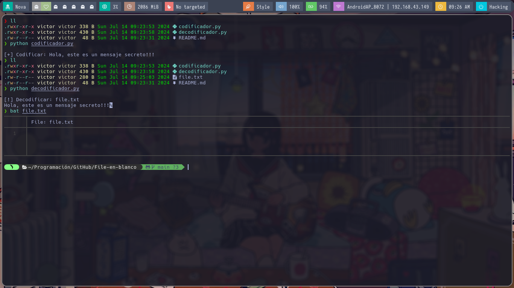
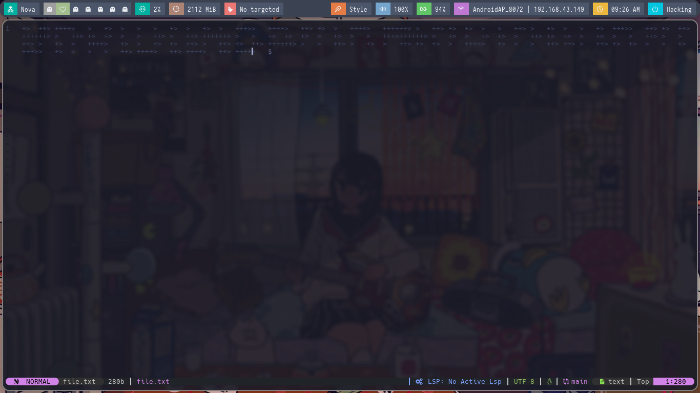

# Proyecto de Codificación y Decodificación

Este proyecto consiste en dos scripts de Python: uno para codificar un mensaje en un archivo de texto utilizando espacios y tabulaciones, y otro para decodificar ese mensaje desde el archivo.

### Requisitos
- Python 3.x

### Ejemplo de Uso:



## Codificador

El script `codificador.py` toma un mensaje de entrada del usuario y lo codifica en un archivo de texto llamado `file.txt`. Cada carácter del mensaje se convierte en su representación binaria, y luego cada bit se representa como un espacio (para 0) o una tabulación (para 1).

### Uso

Para ejecutar el codificador, usa el siguiente comando:

```bash
python codificador.py
```

## Decodificador

El script `decodificador.py` lee un archivo de texto codificado (por defecto `file.txt`), y decodifica el mensaje interpretando espacios como 0 y tabulaciones como 1. Luego convierte esta secuencia binaria de nuevo en texto.

### Uso

Para ejecutar el decodificador, usa el siguiente comando:

```bash
python decodificador.py
```

## Archivo file.txt desde mi neovim



Podemos ver los espacios en blanco y tabulaciones del archivo `file.txt`.
